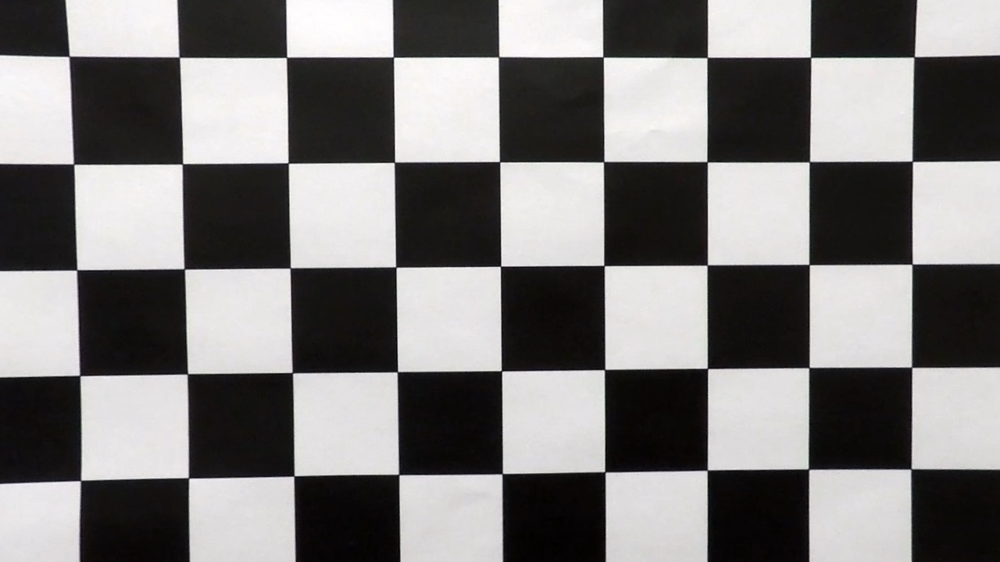
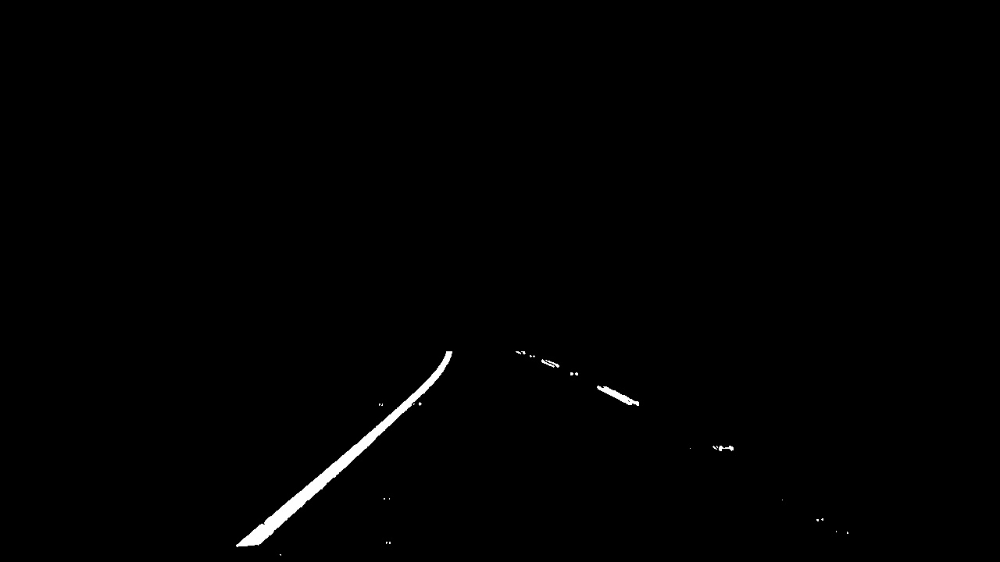
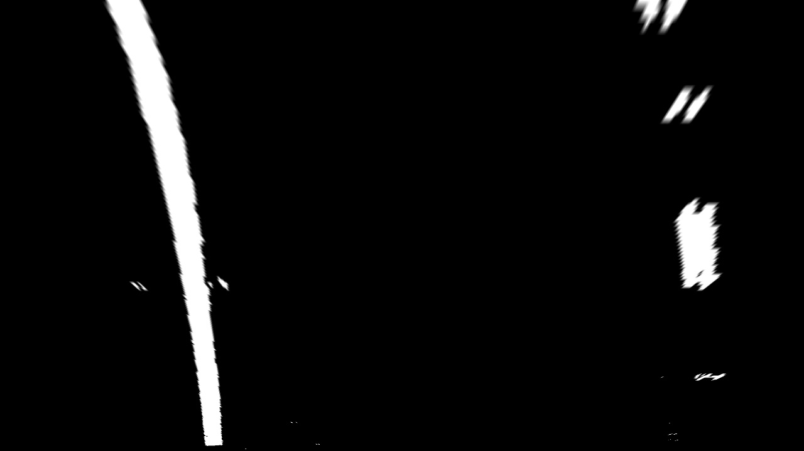
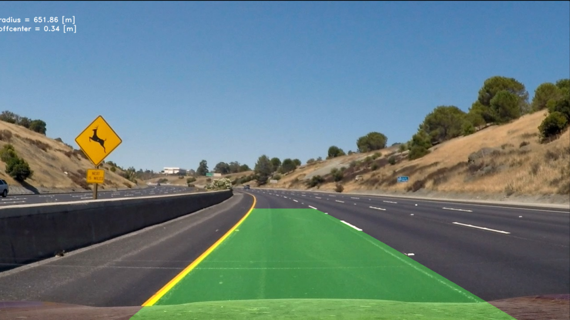

## Writeup Template

### You use this file as a template for your writeup.

---

**Lane Finding Project**

The goals / steps of this project are the following:

* Compute the camera calibration matrix and distortion coefficients given a set of chessboard images.
* Apply a distortion correction to raw images.
* Use color transforms, gradients, etc., to create a thresholded binary image.
* Apply a perspective transform to rectify binary image ("birds-eye view").
* Detect lane pixels and fit to find the lane boundary.
* Determine the curvature of the lane and vehicle position with respect to center.
* Warp the detected lane boundaries back onto the original image.
* Output visual display of the lane boundaries and numerical estimation of lane curvature and vehicle position.

[//]: # (Image References)

[image1]: ./examples/undistort_output.png "Undistorted"
[image2]: ./test_images/test1.jpg "Road Transformed"
[image3]: ./examples/binary_combo_example.jpg "Binary Example"
[image4]: ./examples/warped_straight_lines.jpg "Warp Example"
[image5]: ./examples/color_fit_lines.jpg "Fit Visual"
[image6]: ./examples/example_output.jpg "Output"
[video1]: ./project_video.mp4 "Video"

---

### Writeup / README

#### 1. Provide a Writeup that includes all the rubric points and how you addressed each one.

You're reading it!

### Camera Calibration

#### 1. Briefly state how you computed the camera matrix and distortion coefficients. Provide an example of a distortion corrected calibration image.

    * Preparing Object Points:
        Creating a 3D grid of real-world coordinates representing the chessboard's corners in the calibration pattern, assuming all z-coordinates are 0.

    * Detecting Chessboard Corners:
        - For each chessboard image, we are reading it and resizing it to a consistent size.
        - Converting it to grayscale to simplify processing and improve accuracy
        - Usage of cv2.findChessboardCorners() to detect the inner corners

    * Calibrate the Camera
        - Passing object points and image points alongside the image size to cv2.calibrateCamera()
        - This function calculates camera matrix, distortion coefficients and rotation/translation vectors

|

#### 2. Describe how (and identify where in your code) you used color transforms, gradients or other methods to create a thresholded binary image.  Provide an example of a binary image result.

    * Color Transforms : main.py, lines 28-30
        - Converting input image from RGB to HLS color space.
        - L channel is used for detecting edges via gradients as it represents lightness (intensity)
        - S channel is used for thresholding based on color saturation which helps isolating lane lines in well lit areas

    * Edge Detection : main.py, lines 36 - 42
        - Applying Sobel operator to grayscale L channel in the x-direction because we assume lane lines are vertical
        - Applying binary threshold to filter out weak gradients and keep strong vertical edges, such as lane lines

    * Combining Thresholds
        - The results of gradient-based and color-based thresholds are combined using a logical OR. Done so we can capture lines in various conditions

    * RoI Masking : main.py, lines 48 - 59
        - Applying polygonal mask to limit the region of interest (the road area in the image)
    
|

#### 3. Describe how (and identify where in your code) you performed a perspective transform and provide an example of a transformed image.

A perspective transform was applied to the binary thresholded image to create a bird's-eye view of the road. Process involved mapping a region of interest in the original image to a new perspective.

    * Defining the Source and Destination Points : main.py, lines 213 - 225
        - Source points represent a trapezoidal region in the original image where lane lines are located
        - Destination points define the corresponding rectangle in the transformed (bird's-eye view) image

    * Perspective Transform Function : main.py, lines 63 - 69
        - cv2.getPerspectiveTransform() computes the transformation matrix that maps the source points to destination points
        - cv2.warpPerspective() applies the transformation matrix to the image, warping it to the new perspective

#### 4. Describe how (and identify where in your code) you identified lane-line pixels and fit their positions with a polynomial?

Lane-line pixels were identified and their positions were fit using a histogram-based sliding window tehnique followed by polynomial fitting.

    * Creating a Histogram to Locate Lane Bases : main.py, line 230
        -Histogram is computed as the sum of pixel intensities along the vertical axis for the bottom half of the warped binary image. Peaks in the histogram indicate the likely x-positions of the lane line bases

    * Identifying Lane Pixels using Sliding Windows : main.py, line 234
        - Sliding window method identifies pixels belonging to the left and right lane lines. Process is next:
            - Window Initialization: dividing binary image into nwindows vertical segments, setting window height and width, initializing starting x-positions for the left and right lane lines using find_lane_bases(), main.py, line 81
            - Iterating Through Windows: for each window, we define its boundaries in x and y directions (lines 95 - 100), identify all non-zero pixels within each window (lines 102 - 106), if enough pixels are detected, recenter the window to the mean x-position of detected pixels for the next level (lines 112 - 116)

    * Fit Lane Line Pixels with a Polynomial : main.py, lines 126 - 129

#### 5. Describe how (and identify where in your code) you calculated the radius of curvature of the lane and the position of the vehicle with respect to center.

The radius of curvature of the lane and the vehicle's position relative to the center are calculated in the funtion 'calculate_radius_and_vehicle_position()', line 156

    * Radius of Curvature : main.py, lines 161 - 176
        - Converting pixel values to real-world space using scaling factors (example: ym_per_pix - meters per pixel in the y-direction (30 meters for 720 pixels)). Fitting a new polynomial (np.polyfit()) for both lane lines in a real-world space. Using the formula for radius of curvature to calculate the radius
    
    * Vehicle Position with Respect to the Center : main.py, lines 178 - 179
        - Calculating the lane center as the midpoint between the bottom x-intercepts of the left and right polynomials
        - Subtract the image center (assuming to align with the vehicle's camera center) from the lane center
        - Convert the offset to meters using xm_per_pix

#### 6. Provide an example image of your result plotted back down onto the road such that the lane area is identified clearly.

### Pipeline (video)

#### 1. Provide a link to your final video output.  Your pipeline should perform reasonably well on the entire project video (wobbly lines are ok but no catastrophic failures that would cause the car to drive off the road!).

TODO: Add your text here!!!

### Discussion

#### 1. Briefly discuss any problems / issues you faced in your implementation of this project.  Where will your pipeline likely fail?  What could you do to make it more robust?

TODO: Add your text here!!!

